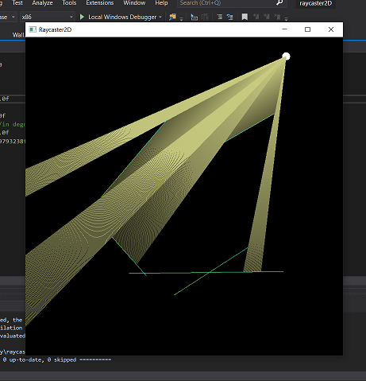

```


                               _            _____ ______ 
                              | |          / __  \|  _  \
 _ __ __ _ _   _  ___ __ _ ___| |_ ___ _ __`' / /'| | | |
| '__/ _` | | | |/ __/ _` / __| __/ _ \ '__| / /  | | | |
| | | (_| | |_| | (_| (_| \__ \ ||  __/ |  ./ /___| |/ / 
|_|  \__,_|\__, |\___\__,_|___/\__\___|_|  \_____/|___/  
            __/ |                                        
           |___/                                         


```
### raycaster2D
a simple 2D raycasting simulation using [SFML](https://www.sfml-dev.org/) library
___
### Versions
* [v3.0]
    constrained motion of player within window
    color gradient rays & walls  
    
    
    <br>
* [v2.0](extras/ss_v2.png)
    multiple random wall generation and ray collision
* [v1.0](extras/ss_v1.png)
    single line wall ray intersection


### Controls

>* A [Rotate Player Anticlockwise]  
>* D [Rotate Player Clockwise]  
>* Arrow Keys [Player Motiion]

### Build

Compile the VS2019 soltuion file
- Configure Global Macros in Base.h

[GPL-3.0 License](LICENSE)