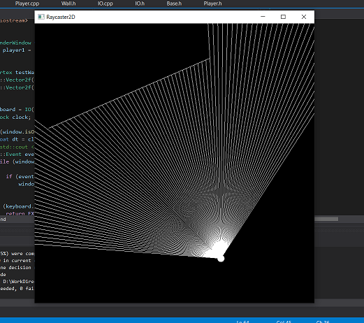

# raycaster2D
a simple 2D raycasting simulation using [SFML](https://www.sfml-dev.org/) library
___
### Versions
* [v1.0]
    single line wall ray intersection

### Keyboard Controls

> A [Rotate Player Anticlockwise]
> D [Rotate Player Clockwise]
> Arrow Keys [Player Motiion]

### Build

Compile the soltuion file
- Configure Global Macros in Base.h

[GPL-3.0 License](LICENSE)